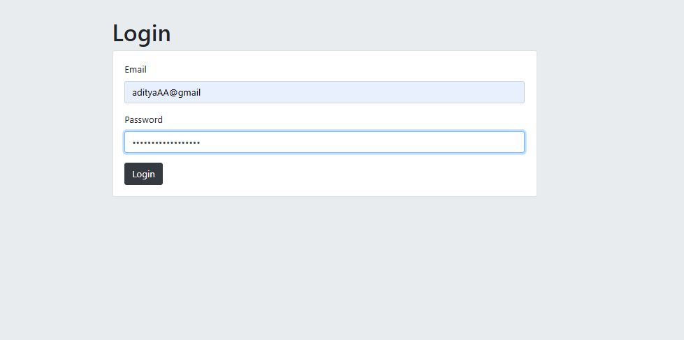
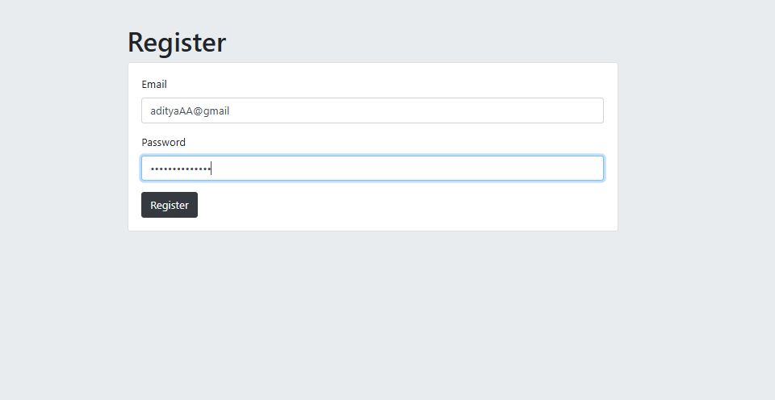

## 🔐 Login & Register Page – Level 5 Authentication(Environment Variables + Session-Based Authentication) #

This project is a Login & Register Authentication System built with Node.js, Express, EJS, and PostgreSQL.
It demonstrates Level 5 Authentication, where:

User passwords are hashed and salted using bcrypt.js.

Session-based authentication is implemented with cookies using express-session.

Database credentials and session secrets are stored in environment variables (.env) for security.

Users can register with an email and password, log in securely, and access a protected secrets page.
The project uses a modular EJS structure with partials (header.ejs, footer.ejs) and serves static assets through the public folder.

---
🔑 Levels of Authentication:<br><br>
Level 1: Basic Cipher (Caesar, Hill, Playfair, etc.)<br>
Level 2: Hashing (MD5, SHA, etc.)<br>
Level 3: Hashing + Salt Rounds (bcrypt)<br>
Level 4: Session-Based Authentication (bcrypt + Passport.js + Cookies)<br>
Level 5: Environment Variables + Session-Based Authentication<br>
Level 6: OAuth (Open Authorization) 


---

## 📷 Gallery

| SignUp Page | Login Page |
|-------------|------------|
|  |  |

| Register Page | Secret Page |
|---------------|-------------|
|  |  |


---

## ⚙️ Setup Instructions

 1️⃣ Create Table in PostgreSQL(users):
 <br>
    as given in the query.sql
 <br><br>
 
2️⃣ Install Dependencies:
```bash
npm i
npm i pg express ejs body-parser
```

4️⃣ Edit .env file:<br>
    as give in the .ENV.txt
<br><br>
5️⃣ Run Server: 
```bash
node index.js
```
---
👉 [Open App on Localhost](http://localhost:3000)
